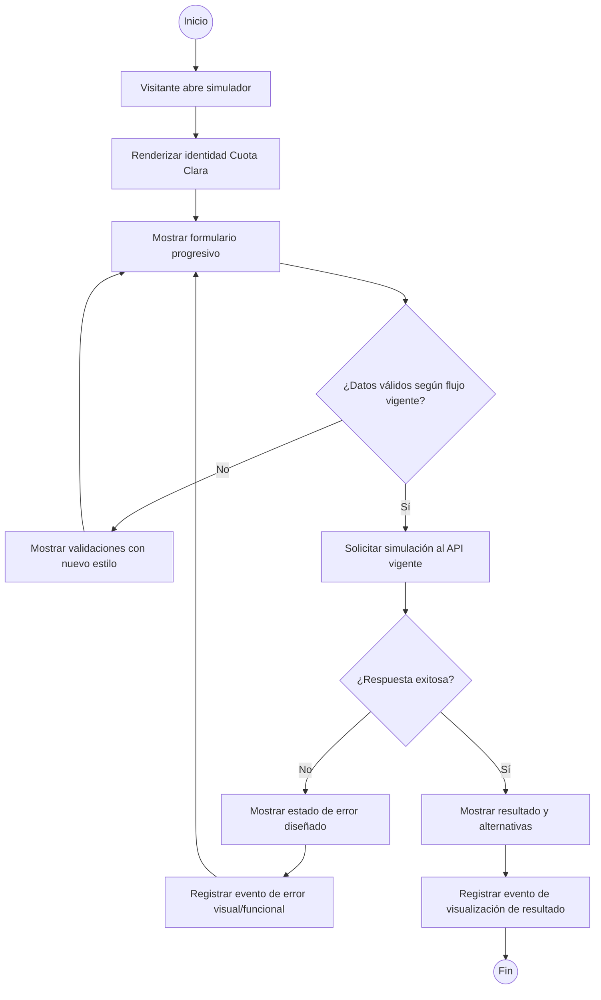
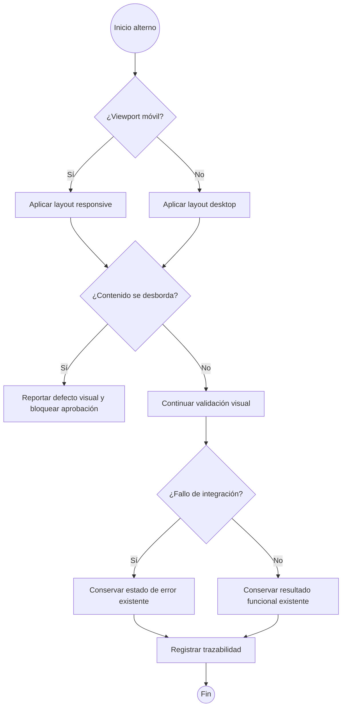

# 1. Título de la HU

- ID: HU-01
- Épica / Feature: Experiencia visual del simulador
- Área / Torre / Dominio: Frontend / Experiencia de usuario
- Prioridad: Alta
- Stakeholders: Visitante del simulador, producto, diseño, desarrollo frontend, QA

## 2. Contexto y Objetivo

- Contexto del negocio: El simulador de crédito requiere presentar una experiencia visual coherente con el Design System vigente de Cuota Clara.
- Problema a resolver: La página debe reflejar el nuevo look and feel en toda la experiencia, manteniendo legibilidad, jerarquía y consistencia entre formulario, resultados y estados.
- Objetivo del cambio: Permitir que el visitante visualice la página completa con la identidad visual aprobada, en escritorio y móvil.
- Beneficio esperado: Mejorar la comprensión del flujo y la percepción de consistencia, sin alterar cálculos, reglas, contratos ni funcionalidades existentes.
- Fuera de alcance: Cambios en reglas de negocio, cálculos de crédito, tasas, rangos, endpoints, DTOs, persistencia, autenticación, aprobación crediticia, textos legales no aprobados, nuevas funcionalidades o integración con servicios externos.

## 3. Historia de Usuario

Como visitante del simulador
Quiero visualizar toda la página con el nuevo look and feel de Cuota Clara
Para completar y consultar la simulación en una experiencia clara, consistente y adaptable a escritorio y móvil.

## 4. Alcance Funcional

### 4.1 Flujos incluidos

1. Visualización de la página introductoria y encabezado con la identidad visual vigente.
2. Visualización del formulario progresivo de simulación.
3. Visualización de los campos dependientes y sus estados habilitado/deshabilitado.
4. Visualización de estados inicial, carga, error y resultado.
5. Visualización de la tarjeta de cuota, detalle del crédito, alternativas de plazo y avisos informativos.
6. Adaptación responsive para escritorio y móvil.
7. Navegación por teclado y foco visible en los elementos interactivos.

### 4.2 Flujos no incluidos

- Modificar la secuencia funcional del simulador.
- Modificar valores, reglas, validaciones o resultados.
- Crear nuevas pantallas o endpoints.
- Cambiar el contenido legal o convertir el resultado en una oferta financiera.

### 4.3 Supuestos

- El Design System vigente es la fuente visual única.
- La identidad se implementa sin logos, nombre comercial ni activos del banco de referencia.
- Se conservan las funcionalidades y datos actualmente disponibles.
- Las pruebas responsive se ejecutan al menos en una resolución desktop y una móvil representativas.

## 5. Reglas de Negocio (RNs)

### RN-01 — Aplicación integral del Design System

- Descripción: Toda la página debe aplicar la identidad Cuota Clara: fondo negro `#080808`, rojo `#FF334D`, verde `#62F58C`, bordes verde oscuro `#26362C`, Manrope para interfaz y DM Mono para metadatos, pasos y valores de referencia.
- Datos requeridos: Componentes y estados visibles de la página.
- Lógica: Si un componente pertenece a la experiencia del simulador, entonces debe usar los tokens y patrones visuales definidos en el Design System.
- Parametrización asociada: Tokens de color, tipografía, espaciado y radios.
- Excepciones / errores: Un componente que no pueda aplicar un token debe reportarse como defecto visual y no aprobarse.
- Evidencia / trazabilidad requerida: Capturas de revisión visual y registro del componente revisado.

### RN-02 — Legibilidad de cards destacadas

- Descripción: Las cards verdes deben presentar el texto en negro intenso, manteniendo contraste y jerarquía visual.
- Datos requeridos: Título, valor, metadato y contenido de cada card.
- Lógica: Si una card usa superficie verde, entonces su contenido principal debe usar texto negro y no rojo.
- Parametrización asociada: Verde `#62F58C` y texto negro de alto contraste.
- Excepciones / errores: Texto rojo, ilegible o con contraste insuficiente constituye incumplimiento.
- Evidencia / trazabilidad requerida: Captura de cards en estado inicial y resultado.

### RN-03 — Conservación funcional

- Descripción: El cambio visual no debe modificar el comportamiento existente.
- Datos requeridos: Campos, validaciones, acciones, resultados y estados existentes.
- Lógica: Si el usuario interactúa con la página rediseñada, entonces las mismas entradas válidas deben producir el mismo comportamiento y resultado funcional que antes del cambio.
- Parametrización asociada: Ninguna nueva.
- Excepciones / errores: Diferencias en cálculos, habilitación de campos, respuestas o mensajes funcionales deben bloquear la aprobación.
- Evidencia / trazabilidad requerida: Resultado de regresión funcional y referencia de la versión validada.

### RN-04 — Adaptación responsive

- Descripción: La página debe conservar jerarquía, legibilidad y operabilidad en escritorio y móvil.
- Datos requeridos: Viewport desktop y viewport móvil, contenido completo y estados de la página.
- Lógica: Si el viewport cambia entre desktop y móvil, entonces el contenido debe reorganizarse sin desbordamiento horizontal, pérdida de información ni controles inaccesibles.
- Parametrización asociada: Breakpoints definidos por el frontend.
- Excepciones / errores: Scroll horizontal no intencional, texto cortado, controles superpuestos o card ilegible constituyen incumplimiento.
- Evidencia / trazabilidad requerida: Capturas desktop y móvil por estado principal.

### RN-05 — Accesibilidad visual e interacción

- Descripción: Los elementos interactivos deben conservar etiquetas, foco visible y contraste suficiente.
- Datos requeridos: Campos, botones, selectores, mensajes y estados.
- Lógica: Si un elemento es interactivo, entonces debe poder identificarse visualmente, enfocarse por teclado y mostrar su estado sin depender exclusivamente del color.
- Parametrización asociada: Foco visible y contraste AA según el Design System.
- Excepciones / errores: Elementos sin foco, sin etiqueta asociada o diferenciados únicamente por color deben corregirse.
- Evidencia / trazabilidad requerida: Evidencia de navegación por teclado y revisión de contraste.

## 6. Criterios de Aceptación (Given/When/Then)

### CA-01 — Visualización general en desktop

**Escenario positivo**

- Given que el visitante abre el simulador en un viewport desktop
- When la página termina de cargar
- Then visualiza encabezado, introducción, formulario, tarjetas, resultados y avisos usando el Design System vigente, sin elementos desbordados.

### CA-02 — Visualización general en móvil

**Escenario positivo**

- Given que el visitante abre el simulador en un viewport móvil
- When recorre la página de inicio a fin
- Then visualiza todos los contenidos y puede operar los controles sin scroll horizontal ni solapamientos.

### CA-03 — Card destacada

**Escenario positivo**

- Given que existe una card con superficie verde
- When el visitante visualiza su título y valor
- Then el texto se presenta en negro intenso, con jerarquía legible y contraste suficiente.

### CA-04 — Estados del simulador

**Escenario positivo**

- Given que el simulador se encuentra en estado inicial, carga, error o resultado
- When el visitante visualiza el estado correspondiente
- Then identifica claramente el estado, conserva el contexto del flujo y dispone de la acción indicada por el estado.

### CA-05 — Conservación de interacción

**Escenario positivo**

- Given que el visitante diligencia los mismos datos válidos usados antes del cambio visual
- When solicita la simulación
- Then obtiene la misma respuesta funcional, reglas de validación y resultado de negocio, con la nueva presentación visual.

### CA-06 — Campos dependientes

**Escenario negativo**

- Given que el visitante aún no ha completado la selección previa requerida
- When visualiza el campo dependiente
- Then el campo permanece deshabilitado y su estado se comunica de forma visible, sin permitir una selección inválida.

### CA-07 — Error funcional conservado

**Escenario negativo**

- Given que el visitante ingresa datos inválidos o incompletos
- When intenta continuar o solicitar la simulación
- Then el sistema conserva la validación existente, muestra un mensaje accionable y no presenta un resultado como válido.

### CA-08 — Fallo de carga

**Escenario negativo**

- Given que ocurre un fallo al cargar catálogos o solicitar la simulación
- When el servicio devuelve un error
- Then la interfaz muestra el estado de error diseñado, mantiene el contexto y ofrece únicamente la acción disponible para recuperación, sin mostrar datos ficticios como resultado exitoso.

### CA-09 — Viewport extremo

**Escenario borde**

- Given que el visitante usa un viewport móvil estrecho dentro de los tamaños soportados
- When visualiza una card, un selector o un botón con contenido largo
- Then el contenido se ajusta o envuelve sin cortarse, superponerse ni quedar fuera del área operable.

### CA-10 — Navegación por teclado

**Escenario borde**

- Given que el visitante navega usando únicamente el teclado
- When avanza por los campos, selectores y botones
- Then el foco sigue un orden lógico, es visible y permite completar las acciones principales sin depender del mouse.

## 7. Matriz de Parámetros (Parametrización)

| Parámetro | Descripción | Tipo (bool, lista, num, string) | Valores permitidos | Fuente (Hub/BD/Config) | Dueño | Regla RN asociada | Observaciones |
|---|---|---|---|---|---|---|---|
| colorFondo | Fondo principal de la experiencia | string | `#080808` | Configuración visual frontend | Diseño / Frontend | RN-01 | No alterar reglas funcionales |
| colorRojo | Color de tipografía y jerarquía | string | `#FF334D` | Configuración visual frontend | Diseño / Frontend | RN-01 | Aplicar según componente |
| colorVerde | Color de acentos, acciones y cards | string | `#62F58C` | Configuración visual frontend | Diseño / Frontend | RN-01, RN-02 | Texto de card en negro |
| colorBorde | Borde de superficies y controles | string | `#26362C` | Configuración visual frontend | Diseño / Frontend | RN-01 | Mantener contraste |
| fuenteInterfaz | Tipografía de interfaz | string | Manrope | Configuración visual frontend | Diseño / Frontend | RN-01 | Incluye jerarquías y cifras |
| fuenteMetadatos | Tipografía de pasos y referencias | string | DM Mono | Configuración visual frontend | Diseño / Frontend | RN-01 | No usar para textos extensos |
| viewportDesktop | Tamaño de validación desktop | lista | Según matriz QA aprobada | Configuración QA | QA | RN-04 | Pendiente fijar resolución exacta |
| viewportMovil | Tamaño de validación móvil | lista | Según matriz QA aprobada | Configuración QA | QA | RN-04 | Pendiente fijar resolución exacta |

## 8. Matriz de Integraciones

| Sistema/Servicio | Propósito | Endpoint lógico | Método | Request (campos) | Response (campos) | Reglas de validación | Timeout | Reintentos | Manejo de error | Auditoría/Log | Observaciones |
|---|---|---|---|---|---|---|---|---|---|---|---|
| API de catálogos existente | Cargar actividades y convenios | Contrato vigente de catálogos | Según contrato vigente | Parámetros actuales | Actividades y convenios actuales | No modificar contrato ni datos | Vigente | Vigente | Mostrar estado de error existente con nuevo estilo | Registrar resultado de carga | El look and feel no agrega integración |
| API de simulación existente | Calcular y devolver la propuesta | Contrato vigente de simulación | Según contrato vigente | Datos actuales del formulario | Tasa, cuota, plazo, detalle y alternativas actuales | Validaciones server-side vigentes | Vigente | Vigente | Mostrar estado de error existente con nuevo estilo | Registrar resultado de simulación | No cambiar cálculo ni respuesta |

## 9. Diseño de Pantallas / UX

### 9.1 Pantalla(s) involucrada(s)

- Nombre de pantalla: Página completa del simulador Cuota Clara.
- Tipo: Consulta y diligenciamiento interactivo.
- Secciones: Encabezado, introducción, progreso, actividad, convenio, ingresos y descuentos, monto y condiciones, resultado, alternativas de plazo, avisos informativos y legales.
- Acciones disponibles: Acciones existentes del simulador, conservando sus nombres y comportamiento.
- Estados visuales: Inicial, campo habilitado, campo deshabilitado, carga, error, resultado, alternativa seleccionada y foco de teclado.
- Mensajes de error y vacíos: Mantener el contenido funcional vigente; actualizar únicamente presentación visual cuando sea necesario para alinearlo al Design System.

### 9.2 Especificación de Campos por Sección

| Sección | Campo | Tipo (texto, número, moneda, fecha, checkbox, combo) | Fuente (radicación/BD/servicio X) | Editable (S/N) | Obligatorio (S/N) | Visible (S/N) | Validaciones | Observaciones |
|---|---|---|---|---|---|---|---|---|
| Encabezado | Nombre de producto propio | Texto | Configuración frontend | N | N | S | Copy aprobado | No usar marca externa |
| Progreso | Paso actual | Texto/metadato | Estado frontend | N | N | S | Debe reflejar el paso real | Usar DM Mono |
| Perfil | Actividad | Combo | Servicio de catálogos existente | S | S | S | Validaciones vigentes | Aplicar estado seleccionado y foco |
| Perfil | Convenio | Combo dependiente | Servicio de catálogos existente | S | S | S cuando actividad esté seleccionada | No habilitar antes de la dependencia | Mostrar estado deshabilitado |
| Ingresos | Ingresos mensuales | Moneda COP | Entrada del visitante | S | S | S cuando corresponda | Reglas y rangos vigentes | Formato visual existente |
| Ingresos | Descuentos de nómina | Moneda COP | Entrada del visitante | S | S | S cuando corresponda | No superar ingresos según regla vigente | Error accionable |
| Crédito | Monto solicitado | Moneda COP | Entrada del visitante | S | S | S cuando corresponda | Rangos vigentes | Presentar con jerarquía visual |
| Crédito | Tasa EA | Porcentaje | API de simulación existente | N | N | S en resultado | Formato vigente | Resultado informativo |
| Crédito | Plazo | Combo/tarjeta de alternativa | API de simulación existente | S según flujo actual | S según flujo actual | S | Plazos habilitados vigentes | Selección claramente identificable |
| Resultado | Cuota mensual estimada | Moneda COP | API de simulación existente | N | N | S cuando exista resultado | Resultado válido vigente | Card verde con texto negro |
| Resultado | Total estimado pagado | Moneda COP | API de simulación existente | N | N | S cuando exista resultado | Resultado válido vigente | Mantener aclaraciones |
| Avisos | Nota informativa y legal | Texto | Configuración frontend | N | N | S | Copy aprobado | No presentar oferta real |

### 9.3 Pestañas (si aplica)

No aplica. La experiencia se mantiene en una página de flujo continuo.

## 10. BPM / Flujo del Proceso (Mermaid)

### 10.1 Flujo principal (Mermaid flowchart)

### 10.2 Flujos alternos y de excepción (Mermaid flowchart)

## 11. Trazabilidad y Auditoría

- Eventos a registrar: Renderizado de página, cambio de viewport durante validación, interacción con campo, envío de simulación, visualización de resultado, error de integración y defecto visual identificado.
- Datos mínimos por evento: timestamp, usuario o rol automático, pantalla, componente, estado, acción, resultado, mensaje técnico no sensible y correlación de la ejecución cuando exista.
- Reglas de retención: Usar las reglas de observabilidad vigentes; esta HU no introduce almacenamiento adicional ni datos personales reales.

## 12. Notificaciones y Documentos

No aplica. La HU no crea notificaciones ni documentos.

## 13. Estados y Enrutamiento

- Estado inicial: Página renderizada con identidad visual vigente.
- Estados intermedios: Formulario en edición, campo dependiente deshabilitado, carga, validación, error y resultado.
- Estado final: Resultado visualizado o estado de error recuperable, según el flujo existente.
- Reglas de transición: Mantener las transiciones actuales; el cambio visual no agrega estados de negocio.
- Enrutamiento: Permanecer en la ruta vigente del simulador.

## 14. Requisitos No Funcionales (NFR)

- Seguridad: No agregar datos sensibles, secretos, tokens ni activos de marca externa. Mantener validación y manejo seguro de errores.
- Disponibilidad / resiliencia: El rediseño no debe impedir la carga ni la recuperación de los estados existentes.
- Observabilidad: Conservar logs y trazas actuales; identificar errores de renderizado y recursos visuales faltantes.
- Rendimiento: El nuevo estilo no debe introducir una degradación perceptible ni bloquear la interacción inicial. El umbral exacto queda pendiente de definición.
- Cumplimiento: Mantener avisos de carácter informativo, exclusión del seguro de vida cuando corresponda y ausencia de promesa de aprobación.

## 15. Casos de Prueba sugeridos (QA)

1. Verificar la página completa en desktop con el flujo principal.
2. Verificar la página completa en móvil con el flujo principal.
3. Verificar color de fondo, rojo, verde, bordes y tipografías contra los tokens definidos.
4. Verificar texto negro intenso en todas las cards verdes.
5. Verificar estado inicial.
6. Verificar estado de carga.
7. Verificar estado de error de catálogo.
8. Verificar estado de error de simulación.
9. Verificar resultado y alternativas de plazo.
10. Verificar que los campos dependientes mantengan su habilitación vigente.
11. Verificar validaciones con datos incompletos y negativos.
12. Verificar viewport móvil estrecho con contenido largo.
13. Verificar ausencia de scroll horizontal no intencional.
14. Verificar foco visible y orden lógico de tabulación.
15. Verificar contraste y que ningún estado dependa únicamente del color.
16. Ejecutar regresión para confirmar que cálculos, respuestas y contratos no cambiaron.
17. Verificar que no existan logos, textos o activos del banco de referencia.

## 16. Pendientes por definir (Preguntas)

- ¿Cuál es la resolución exacta de referencia para desktop y móvil en la matriz QA?
- ¿Cuál es el umbral de rendimiento aceptable para la primera renderización después del rediseño?
- ¿Cuál es el copy legal final aprobado para la versión a implementar?
- ¿Qué navegador y versiones mínimas deben incluirse en la validación responsive?
